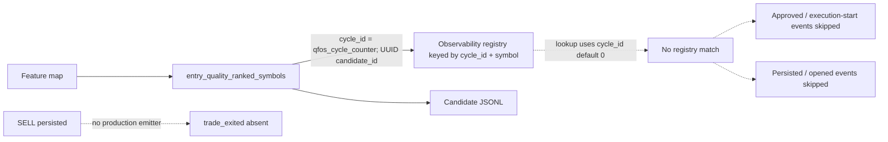

# Phase 2A Observability Audit

Date: 2026-07-10  
Scope: source and persisted runtime artifacts only; no trading logic was changed.

## Executive finding

`logs/trades/` is empty because the trade-event emitters are **never reached**.  This is not a Docker mount, configuration, permission, or alternate-output-path problem.

The direct cause is an identifier mismatch in the in-memory observability registry:

* Candidate ranking creates and registers entries under `qfos_cycle_counter` in `main.py:7687-7725` (first observed runtime cycle: `1`).
* Every later lookup uses `globals().get('cycle_id', 0)` (for example `main.py:11333-11351`).  No assignment to `cycle_id` exists in `main.py`; the only producer is `qfos_cycle_counter`.
* Thus the lookup requests `(0, symbol)` while the registry contains `(1+, symbol)`.  `get_candidate_info()` returns `None`, and each guarded lifecycle call is skipped.

Runtime evidence: `logs/candidates/candidates_2026-07-01.jsonl` records candidate events with `cycle_id: 1`; the latest file records `cycle_id: 112`.  `logs/trades/` exists but has no files.  The manager creates both directories at `observability.py:183-184`, proving the import/configuration/path were active.

## 1. Event wiring

| Event | Implemented | Reachable from active loop | Actually called in captured run | Evidence / required path |
|---|---|---:|---:|---|
| `candidate_ranked` | Yes, `observability.py:331-369` | Yes | Yes | `entry_quality_ranked_symbols()` emits at `main.py:7709` and `7733`; JSONL artifacts prove it. |
| `candidate_filtered` | Yes, `observability.py:374-421` | Stage 1 yes; Stage 2 blocked by cycle mismatch | Yes, Stage 1 only | Entry-quality emit at `main.py:7799`; stage-2 emits at `11296` and `11457` require the failed lookup. |
| `candidate_approved` | Yes, `observability.py:459-489` | No, conditional lookup fails | No | Should occur after `qfos_active_canbuy_authority()` accepts the fill, `main.py:11330-11351`. |
| `trade_execution_started` | Yes, `observability.py:493-509` | No, conditional lookup fails | No | Same approval block, `main.py:11345-11351`. |
| `trade_execution_failed` | Yes, `observability.py:512-533` | No, conditional lookup fails | No | Should occur after `apply_buy` failure (`11364-11380`), final firewall rejection (`11537-11555`), or atomic-persist failure (`11581-11597`). |
| `trade_persisted` | Yes, `observability.py:535-552` | No, conditional lookup fails | No | Should occur only after durable BUY persistence at `main.py:11631-11646`. |
| `trade_opened` | Yes, `observability.py:554-567` | No, conditional lookup fails | No | Should immediately follow `trade_persisted`, `main.py:11647-11652`. |
| `trade_executed` | Yes, legacy emitter, `observability.py:569-593` | No production call | No | Used only by `test_observability.py`; remove or wire only if this legacy semantics is desired. |
| `trade_exited` | Yes, `observability.py:604-631` | No production call | No | No `events.trade_exited(...)` call exists in `main.py`; emit after a SELL has been atomically persisted, using the entry-to-trade mapping. |
| `cycle_summary` | Yes, `observability.py:635-662` | No production call | No | No `events.cycle_summary(...)` call exists in `main.py`; emit once after the cycle’s persistence/telemetry totals are final. |

`batch_filtered` is implemented and called for pause and sideways hard-exposure vetoes, but it has the same `(0, symbol)` lookup defect (`main.py:1662-1681`, `11192-11215`).

## 2. Decision/rejection audit

The active buy path is `AutonomousFundAgent.run_cycle()` → `SimpleAllocator.allocate()` → `entry_policy_allows()` → `qfos_active_canbuy_authority()` → `can_buy()` → final firewall → atomic persistence.  The active wrapper calls `can_buy()` at `main.py:7602` and only overrides a stale caution-cap decision (`7621-7633`).

| Gate / rejection | Exact source | Structured event now | Current non-event evidence |
|---|---|---|---|
| Allocator: no scored/positive strategy, risk status, missing inputs, weak strategy confidence, hourly cap, no qualified candidate | `ai/rl_allocator.py:~450-560` | No | `ALLOCATOR BLOCK` stdout |
| Allocator: bad feature/source, not top-N, held, quarantine, bad history, cooldown, trade window, strict filter, weak signal, stable base, strategy thresholds, below minimum notional, RISK_OFF trend | `ai/rl_allocator.py:~575-675` | No | `ALLOCATOR SKIP` stdout; bare `continue` for stable/min-notional |
| Entry policy: quarantine, blocked strategy, RISK_OFF, confidence floor, hourly cap | `main.py:6097-6130` | Intended `candidate_filtered` at `11266-11310`, but skipped due wrong cycle ID | `EXECUTION_STAGE entry_policy_rejected` stdout |
| `can_buy`: buys disabled, excluded symbol, low/invalid price | `main.py:3951-3961` | Intended filter event at `11385-11470`, but skipped | Result string; caller prints `EXECUTION_STAGE can_buy` |
| `can_buy`: SIDEWAYS position/exposure limits | `main.py:3963-3972` | Same intended, skipped | Same stdout |
| `can_buy`: blocked/near/caution drawdown | `main.py:3973-4025` | Same intended, skipped | Same stdout; stale-caution override is logged by wrapper |
| `can_buy`: poor symbol history, already held, quarantine, daily loss, cooldown, per-symbol trade rate | `main.py:4026-4050` | Same intended, skipped | Same stdout |
| `can_buy`: total or symbol exposure | `main.py:4051-4057` | Same intended, skipped | Same stdout |
| Final execution firewall | `main.py:11527-11559` | Intended `trade_execution_failed`, skipped | `EXECUTION_STAGE final_firewall_rejected` stdout |
| Atomic persistence rejects fill | `main.py:11568-11603` | Intended `trade_execution_failed`, skipped | rejection list and execution telemetry |
| Core `RiskEngine.can_buy`: paused, no/insufficient cash, blocked/near drawdown, BLOCKED state, projected exposure | `core/risk_engine.py:121-160` | No direct observability call | Returns `RiskDecision`; this method is not the instrumented active `main.can_buy` path |

The observed 568 ranked candidates therefore disappear at multiple gates without terminal stage-2 artifacts.  The immediate observability failure is not that their reasons do not exist: `can_buy()` returns strings and prints them.  It is that the only conversion into `candidate_filtered` is guarded by the failed registry lookup.  Earlier allocator rejections have no event call at all.

## 3. Candidate lineage

Identifiers that already exist:

* `candidate_id`: UUID generated in `EventEmitter.candidate_ranked()` and retained only in `_manager._cycle_candidate_ids` (`observability.py:331-369`, `192-219`).
* `cycle_id`: real ranking ID is `qfos_cycle_counter`; downstream code instead uses the unrelated default-zero name.
* `trade_id`: UUID is designed to be created by `trade_execution_started()` and stored on the same registry entry (`observability.py:493-509`, `204-212`), but is never generated because candidate lookup already failed.
* Database trade-row ID: is persisted by the database, but it is neither passed into observability nor mapped to the candidate/trade UUID.
* Strategy ID: the `evo_####` string is present on orders/trade rows, but is not a candidate or trade lifecycle identifier.

Lineage breaks at the first `get_candidate_info(globals().get('cycle_id', 0), symbol)` after ranking.  It also breaks permanently at exit because no entry-trade mapping survives to the SELL path and no production `trade_exited` call exists.

## 4. Why `logs/trades/` is empty

Conclusion: **A — the relevant emitters are never called.**

Proof:

1. Config points to `logs/trades` (`config/observability.yaml:1-5`), and `ObservabilityManager` resolves that exact relative path and creates it (`observability.py:174-184`).
2. Candidate JSONL exists in the sibling configured directory and has current events, so the module is imported and its write path works.
3. `emit()` routes every trade event to `self.trades_dir` and flushes synchronously (`observability.py:277-307`); no conditional disable exists.  Its fail-safe would log an `Observability Fail-Safe` warning on a write exception.
4. The running container is `/app` and has a read/write bind mount `C:\Users\Administrator\Documents\quant-fund-os\logs` → `/app/logs`, confirmed by `docker inspect` on 2026-07-10.  Compose declares the same mount in `docker-compose.yml`.
5. There is no alternate trade path in config, compose, Dockerfile, or the emitter.  Docker’s `json-file` logging affects stdout only, not file writes.
6. The event calls that would write trade files are behind the failed candidate lookup; exit/cycle-summary calls are absent altogether.

The observed empty directory is therefore not an omitted export.  It is a correctly mounted, writable destination with zero calls routed to it.

## 5. Strategy evolution and zero metrics

* Creation: `StrategyDNA.random()` produces `evo_####` names (`ai/evolutionary_engine.py:13-23`); `StrategyPool` creates 12 in memory (`35-40`) and mutates them every 50 agent cycles (`ai/autonomous_agent.py:57-59`).  This pool is not persisted.
* Database rows: `db_strategy_allowed()` creates a missing strategy as `score=0.0, status=active` (`ai/rl_allocator.py:185-205`).  The captured 2026-06-17 database audit shows `evo_*` rows with `score=0`, `sharpe=0`, and `drawdown=0`.
* Intended update: after the primary persistence transaction commits, `main.py:11708-11710` calls `_qfos_apply_strategy_score_updates()`.  That function only adds `pnl` to `score`; it explicitly inserts and leaves `sharpe`/`drawdown` as zero (`10817-10822`).
* Actual loss of attribution: a BUY has `pnl=0`, so it schedules a zero-score update.  A SELL uses its exit strategy (`adaptive_take_profit`, `adaptive_stop_loss`, etc.); those are excluded from the update list at `main.py:11663-11680`.  The original entry `evo_*` strategy is not durably linked to its later exit for scoring.

Thus the zero values are explained by code, not a display issue: strategy rows are initialized at zero, entries contribute zero PnL, exits are not credited to the entry strategy, and no code computes sharpe or drawdown.

## 6. Confidence path

For an evolutionary order, raw feature values are scored in `StrategyPool.score()`.  The score is capped at **0.90** by `min(0.90, 0.50 + matches * 0.02 + avg_strength * 25)` (`ai/evolutionary_engine.py:79-85`).  `SimpleAllocator.allocate()` uses that selected strategy score as `order_confidence` and serializes it on the order (`ai/rl_allocator.py:~533-540`, `~678-701`); `AutonomousFundAgent` copies it into the fill (`ai/autonomous_agent.py:48-56`), and persistence stores the fill field.

Therefore approximately `0.90` is primarily the **strategy-score ceiling**, not a logging or serialization bug.  Separate fallback paths have their own floors/caps (for example scout confidence is `max(QFOS_SCOUT_CONFIDENCE, min(0.95, signal))` at `main.py:2524-2535`; raw-momentum fallback floors SIDEWAYS confidence at `SIDEWAYS_MIN_CONFIDENCE + .01` and caps it at `.95` at `main.py:6227-6233`).  Candidate JSONL currently records `confidence=sig` at `main.py:7716/7740`, which is a different semantic field from executed order confidence; this is another provenance gap.

## 7. `adaptive_take_profit` consistency

The exit is implemented in the current source: `_qfos_exit_decision()` returns `adaptive_take_profit` when `change >= tp_target` at `main.py:4479-4493`.  It is also recognized by exit-routing sets (for example `main.py:935-945` and `2549`).  This confirms the named runtime exit is present in the current working implementation.

The candidates artifacts have metadata `git_commit: "unknown"`, so they cannot prove an exact source commit.  However, their payload shape and timestamps prove the uncommitted observability module was present in the runtime image.  Docker inspection confirms the active container image and mounts but does not provide a source commit label.  Treat exact commit equivalence as unproven until the image is rebuilt with `GIT_COMMIT`/an immutable image label and that identifier is written to the manifest.

## 8. Minimal patch plan (do not implement in this audit)

| File / function | Minimal change | Expected output |
|---|---|---|
| `main.py`, ranking and all post-ranking emit blocks | Establish one per-loop cycle ID (for example assign the generated `qfos_cycle_counter` value to the value used downstream) and replace every `globals().get('cycle_id', 0)` lookup with that single authoritative value. | Stage-2 candidate decisions and entry trade events carry the same nonzero `cycle_id`/`candidate_id` as ranking. |
| `main.py`, allocator rejection paths | At each `ALLOCATOR BLOCK`/`ALLOCATOR SKIP`, emit a `candidate_filtered` (or a batch event for whole-list blocks) using the already-ranked candidate ID. | Every ranked candidate has exactly one terminal decision or proceeds to execution. |
| `main.py`, durable SELL handling | Persist an entry-to-trade mapping with the BUY/trade row, retrieve it on SELL, and call `events.trade_exited()` only after the SELL commit. | A `trade_exited` JSONL record joins deterministically to the originating candidate/trade. |
| `main.py`, end of loop | Call `events.cycle_summary()` once after final accepted/rejected/persisted totals are known. | One reconciled cycle summary per cycle. |
| Trade schema + scoring update path | Store original entry strategy on the position/trade lifecycle; update that strategy only after its exit, and compute/persist the desired sharpe/drawdown metrics rather than hard-coding zeros. | `evo_*` rows receive realized-PnL score changes; sharpe/drawdown semantics become explicit. |
| `observability.py` / manifest | Require `GIT_COMMIT` (or image digest) in the manifest; surface emit failures as a metric/counter in addition to fail-safe logging. | Runtime exports are attributable and write failures cannot be silent. |

No strategy thresholds, exit logic, ranking, or sizing need change for these observability repairs.
